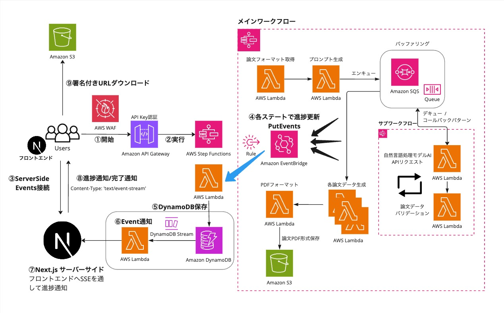
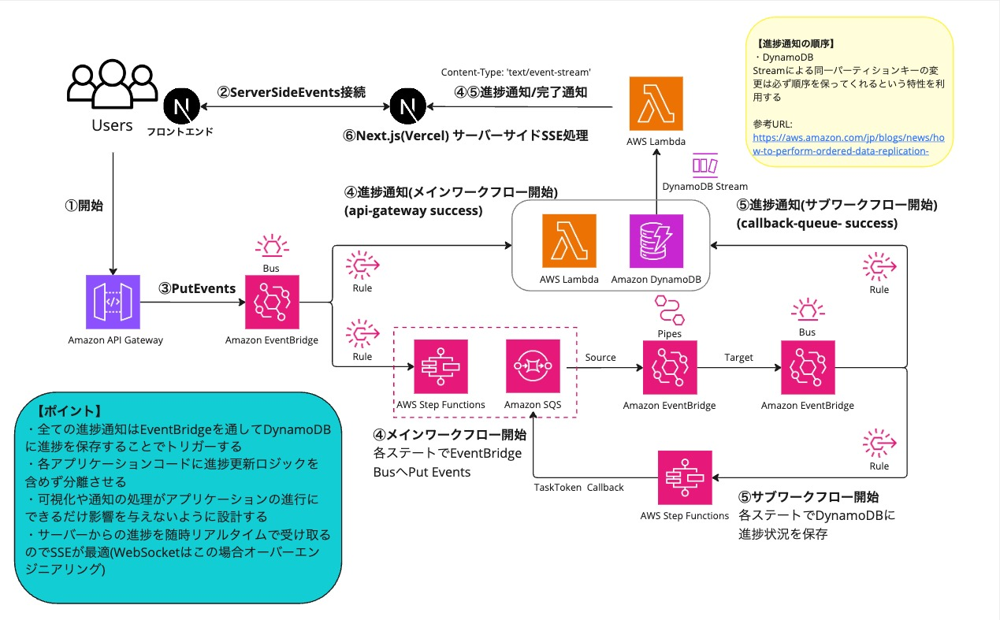

# 嘘論文生成アプリケーション(サーバーサイド・インフラ)

## 参考ドキュメント
- [Miro 構想資料](https://miro.com/app/board/uXjVLuyj9ss=/?share_link_id=568802384893)
- [フロントエンド](https://github.com/haruki-0408/orange)

## はじめに
本プロジェクトは、転職活動用に用意したAIを活用した嘘論文生成プロセスを可視化・制御するためのサーバーサイド・インフラに関する機能リポジトリです。 

運用・監視・保守を考慮したアプリの構想 →　アーキテクチャ設計 → 開発・実装能力 → デプロイ　

まで一貫した能力があることを表現するために作成しましたので、もしよろしければ[構想資料](https://miro.com/app/board/uXjVLuyj9ss=/?share_link_id=568802384893)の資料と[フロントエンド](https://github.com/haruki-0408/orange)のリポジトリも合わせてご覧くださいませ。

## プロジェクトの目的

本プロジェクトは、以下の目的を掲げて開発しました。

1. **サーバーレスアーキテクチャの実践**
   - イベント駆動型アーキテクチャによる疎結合なシステム設計
   - AWS SAMを活用したInfrastructure as Codeの実現
   - マイクロサービスアーキテクチャによる機能の分割と統合
   - 複雑なワークフローのステートマシンによる制御

2. **アーキテクチャ設計能力・開発能力の表現**
   - 複雑なワークフローの効率的な制御と管理
   - 並列処理による処理速度の最適化
   - エラーハンドリングと再試行ロジックの実装
   - スケーラブルなシステム設計の実現

3. **運用・監視システムの確立**
   - 包括的なロギングとモニタリングの実装
   - リアルタイムな進捗管理システムの構築
   - 分散トレーシングによる性能分析
   - CloudWatchとX-Rayを活用した運用管理

4. **最新技術の統合と実験的試み**
   - Anthropic Claude APIによる高度な自然言語処理
   - EventBridgeとDynamoDB Streamsによる非同期処理
   - Server-Sent Eventsによるリアルタイム通知
   - 現段階の生成AIにおける架空論文生成能力の技術検証

## プロジェクト概要

本プロジェクトは、最新のクラウドテクノロジーと生成AIを組み合わせた架空の内容の嘘論文自動生成システムです。ユーモアのある面白い内容の嘘論文を生成することを目的としており虚構新聞からアイデアを着想しイメージしました。

- **生成AI活用**: Anthropic Claude APIを用いた高品質な論文コンテンツの生成
- **マルチメディア生成**: グラフ、表、数式などの研究データの自動生成
- **PDF出力**: LaTeX形式での論文フォーマット生成とPDF変換
- **リアルタイム進捗管理**: 生成プロセスのリアルタイムモニタリング

AWS SAMによるInfrastructure as Codeを採用し、高可用性と拡張性を実現。複雑な論文生成プロセスを、マイクロサービスアーキテクチャにより効率的に処理しています。

## システムアーキテクチャ

### メインアーキテクチャ




本システムは、APIゲートウェイを入り口として、Step Functionsによるワークフロー管理、Lambda関数による処理の実行、DynamoDBによるデータ管理を組み合わせたサーバーレス&イベント駆動型アーキテクチャを採用しています。

#### アーキテクチャの主要コンポーネント詳細

1. **フロントエンド連携**
   - API Gateway: RESTful APIエンドポイントを提供し、クライアントからのリクエストを受け付け
   - EventBridge: イベントルーティングとワークフロートリガーを担当

2. **ワークフロー制御**
   - Step Functions: 複雑な論文生成プロセスを管理
     - エラーハンドリングと再試行ロジック
     - 並列処理の制御（グラフ、表、数式の生成）
     - 状態管理とトランジション制御

3. **コア機能（Lambda関数群）**
   - 論文フォーマット取得: 論文カテゴリに応じた適切なフォーマットを決定
   - プロンプト生成: AIモデルへの最適な指示を生成
   - 生成AI API連携: Anthropic Claude APIとの通信を管理
   - 論文データバリデーション: 生成AIの出力を定義したスキーマに沿うかチェック
   - データ自動修正関数: データがスキーマに沿っていない場合、生成AIの出力を自動修正
   - コンテンツ生成: グラフ、表、数式の並列生成処理
   - PDF変換: 最終成果物の生成

4. **データストレージと管理**
   - S3: 生成された画像やPDFの保存
   - DynamoDB: 進捗状況と中間データの管理
   
5. **進捗管理システム**
   - DynamoDB Streams: データ更新のリアルタイム検知
   - EventBridge: イベントのルーティングとトリガー
   - SSE (Server-Sent Events): クライアントへのリアルタイム通知

このアーキテクチャにより、スケーラブルで信頼性の高い論文生成システムを実現しています。各コンポーネントは疎結合に設計されており、将来の機能拡張や改善に対して柔軟に対応できます。

### 進捗通知システムの詳細アーキテクチャ




DynamoDBストリームとEventBridgeを活用した非同期の進捗通知システムによってStepfunctionsの進捗状態をフロントエンドへリアルタイムに通知しています。

#### 進捗通知の仕組み

1. **データ更新の検知**
   - DynamoDB Streamsが論文生成の進捗状態の変更を検知
   - 変更イベントをリアルタイムでキャプチャ

2. **イベント変換とルーティング**
   - EventBridge Pipesがストリームイベントを処理
   - 必要な形式に変換し、適切な宛先にルーティング

3. **通知処理**
   - Lambda関数が通知ロジックを実行
   - Next.js APIを介してクライアントにSSEで配信

4. **クライアント側の更新**
   - Server-Sent Events (SSE)による効率的な単方向通信
   - クライアントのUIがリアルタイムで更新

この設計により、クライアントは常に最新の進捗状況を把握でき、ユーザーエクスペリエンスが向上します。

## 技術スタック

### AWS クラウドサービス
- **API Gateway**: RESTful APIのエンドポイント提供
- **Lambda**: サーバーレスコンピューティング（Python 3.12）
- **Step Functions**: ワークフローオーケストレーション
- **SQS**: 非同期ジョブキュー
- **EventBridge**: イベント駆動型アーキテクチャの実現
- **DynamoDB**: NoSQLデータベース
- **S3**: オブジェクトストレージ
- **CloudWatch**: ログ管理
- **X-Ray**: 分散トレーシング

### 開発基盤
- **AWS SAM**: インフラストラクチャのコード化（IaC）
- **Python**: サーバーサイドロジックの実装
- **AWS Lambda Powertools**: ロギング、トレーシング収集

### 主要ライブラリ・フレームワーク
- **Anthropic Claude SDK (anthropic==0.40.0)**
  - 用途：高度な自然言語処理による論文本文の生成
  - 特徴：学術的文章の生成に特化した高品質なAIモデル
  - 活用：プロンプトエンジニアリングによる論理的な文章構造の制御

- **SymPy (sympy==1.13.3)**
  - 用途：数式の生成と処理
  - 特徴：数学的表現の厳密な処理と LaTeX 形式への変換
  - 活用：研究論文に不可欠な数式表現の自動生成

- **Matplotlib (matplotlib==3.9.2)**
  - 用途：研究データの可視化、グラフ生成
  - 特徴：論文品質の図表作成、多様なグラフタイプのサポート
  - 活用：実験結果や統計データの視覚化

- **ReportLab (reportlab==4.2.5)**
  - 用途：PDF文書の生成
  - 特徴：プログラマティックなPDFレイアウト制御、日本語フォントサポート
  - 活用：論文形式での最終出力、フォントやレイアウトの精密な制御

- **SVGLib (svglib==1.5.1)**
  - 用途：SVG画像のPDF変換
  - 特徴：ベクター画像の高品質なPDF埋め込み
  - 活用：生成されたグラフや図表のPDFへの統合

## 技術的ハイライト

### セキュリティ設計
- API Keyによるアクセス制御
- IAMロールとポリシーによる最小権限の原則の実践
- 環境変数のSSMパラメータストア管理
- AWS WAFによるAPI Gatewayのセキュリティ強化

### パフォーマンスとスケーラビリティ
- サーバーレスアーキテクチャによる自動スケーリング
- DynamoDBのプロビジョニングされたキャパシティによる予測可能なパフォーマンス
- 使用したワークロードベースの料金

### イベント駆動型アーキテクチャ
- EventBridgeによるイベントルーティングとトリガー
- DynamoDB Streamsによるリアルタイムデータ更新検知
- SQSによる非同期ジョブキュー

### 可用性と信頼性
- Step Functionsによるエラーハンドリングと再試行ロジック
- DynamoDBのデータ保護（削除保護、バージョニング）
- CloudWatch Logsによる包括的なロギング

### 監視と運用管理
- X-Rayによる分散トレーシング
- CloudWatch Logsによるログ管理
- EventBridgeによる進捗監視と通知

## プロジェクト構造

```
melon/
├── events/            # テスト用イベントJSON
├── functions/           # Lambda関数
│   ├── features/       # 機能別Lambda関数
│   └── stepfunctions/  # Step Functions関連Lambda関数
├── layers/             # 共通Lambda Layer
├── tests/            # テストコード
│   └── unit/        # ユニットテスト
└── template.yaml    # SAMテンプレート
```

### ワークフロー詳細

#### メインワークフロー
1. 論文フォーマット取得
2. プロンプトパラメータ生成
3. サブワークフロー実行（論文本文生成）
4. 並列処理
   - グラフ生成
   - 表生成
   - 数式生成
5. PDF変換・出力

#### サブワークフロー（論文生成）
1. 生成AI（Anthropic Claude）による論文本文生成
2. 生成データのバリデーション
3. エラー時の自動修正（最大3回の再試行）
4. メインワークフローへのコールバック

#### 進捗管理フロー
- EventBridgeとDynamoDBによるリアルタイム進捗管理
- WebフロントエンドへのWebhook通知
- 詳細な実行ログの保存

### 品質管理
- ユニットテストの実装
- AWS X-Rayによる性能モニタリング
- CloudWatch Logsによるログ分析
- EventBridgeによる進捗監視

## セットアップガイド

### ローカル開発環境
```bash
# 環境変数ファイルのコピー
cp env.sample.json env.json

# 環境変数ファイルの編集
vi env.json

# SAMビルド
sam build

# ローカルでのLambda関数実行 例：GetFakeThesisTitleCategoryFormat
sam local invoke GetFakeThesisTitleCategoryFormat --event events/get_fake_thesis_title_category_format/event.json --env-vars env.json 
```

### デプロイ手順
```bash
# SAMビルド
sam build --use-container

# SAM templateのチェック (dev, prd) 環境を指定してチェックしないとエラーなので注意
sam validate --config-env dev  
sam validate --config-env prd

# デプロイ（開発環境）
sam deploy --config-env dev

# デプロイ（本番環境）
sam deploy --config-env prd
```
